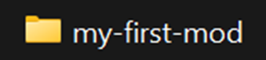
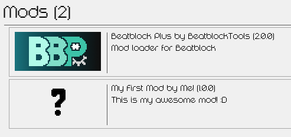

# Creating a Mod

This guide covers creating a mod that appears in the mod list and does nothing.

1) Create a new folder in your `Mods` folder for your mod. It's recommended to name it in `kebab-case`, but it is not forced.



2) In your new folder, create a new file named `mod.json`. This file will hold the metadata about your mod. You should ideally use the folder name as your id.

```jsx title="Mods/my-first-mod/mod.json"
{
    "id": "my-first-mod",
    "name": "My First Mod",
    "author": "Me!",
    "description": "This is my awesome mod! :D",
    "version": "1.0.0",
    "config": []
}
```

3) When you launch the game, your mod will appear in the Mods menu.



## Changing the Mod Icon (Optional)

If you wanna use a custom mod icon, simply put your icon in `Mods/my-first-mod/icon.png`.\
The icon must be 73x33 and has no color limitations.

## Why?

Setting this up:
- Lets Beatblock Plus recognize the mod, so it appears in crash logs and the Mods menu.
- Makes your mod toggleable through the Mods menu.
- Allows the mod to use Beatblock Plus features such as asset injection.
- Is a required step for uploading your mods to the modding discord server.
