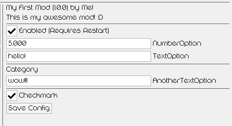
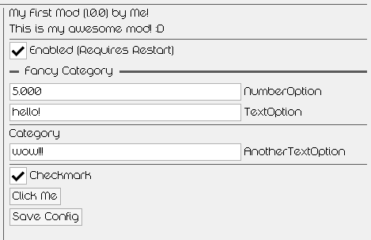

# Creating a Mod Config

There are two ways to create a config for your mod.

# Basic Configuration
This should be used when you only need text, number, and boolean fields. Simply add the values to your `mod.json` file, and they will appear in-game.
```jsx title="Mods/my-first-mod/mod.json"
{
    "id": "my-first-mod",
    "name": "My First Mod",
    "author": "Me!",
    "description": "This is my awesome mod! :D",
    "version": "1.0.0",
    "config": {
        "NumberOption": 5,
        "TextOption": "hello!",
        "Checkmark": true,
        "Category": {
            "AnotherTextOption": "wow!!!"
        }
    }
}
```


You can use the variables anywhere in your code like this:\
`local myNumber = mods["my-first-mod"].config.NumberOption`

# Advanced Configuration
Should be used when you need complex elements that aren't available in the basic configuration. Gives you full control over the ImGui renderer.\
It can't be used together with the basic configuration! You must pick one.\
Create a file named `config.lua` inside `Mods/your-mod/` and render the ImGui elements in it.
```jsx title="Mods/my-first-mod/config.lua"
imgui.SeparatorText("Fancy Category")

mod.config.NumberOption = helpers.InputFloat("NumberOption", mod.config.NumberOption, 0, 10)
mod.config.TextOption = helpers.InputText("TextOption", mod.config.TextOption)

imgui.Separator()

imgui.Text("Category")
mod.config.Category.AnotherTextOption = helpers.InputText("AnotherTextOption", mod.config.Category.AnotherTextOption)

imgui.Separator()

mod.config.Checkmark = helpers.InputBool("Checkmark", mod.config.Checkmark)
if imgui.Button("Click Me") then
    print("I was clicked!")
end
```


# How Configs Are Saved

When you click 'Save Config' in the interface, BBP creates another json file in your mod folder, named `config.json`. This new file contains the configs chosen by the player. The configs in your `mod.json` stay the same, because they are the default values.\
If you're using an Advanced Configuration, you should still write the config table in `mod.json`, as you would for a Basic Configuration.
