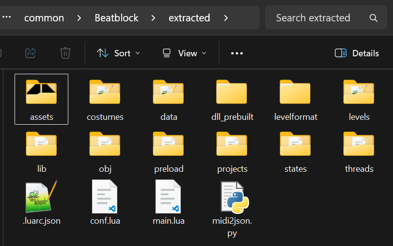

# Extracting Game Files

Having access to the game's files is very important for modding.\
However, Beatblock keeps half of the game's files in the `packed` folder and the other half in the .exe file, and some of the files are zipped which can get messy when looking through it.\
To not go through the hassle every game update, we prepared a Python script that does this for you.

## Installing Python

If you already have Python installed, you can skip this step.

1) Go to the download page of [latest Python](https://www.python.org/downloads/latest).

2) Scroll down and pick the version for your operating system. The recommended version works fine, but you can pick the "embeddable" version if you want Python to be portable.


## Using the Script

1) Download the [`bb-extractor.py`](https://gist.github.com/K4kadu/b280e27e093bd8408903e82ba1a8a384) and place it in your game's installation folder.


2) Depending on your Python setup, you can run it by double clicking, or by using the command `python bb-extractor.py` inside the game folder.\
If you are using the embeddable version, navigate to your Python folder and then run
```
.\python.exe "C:\Program Files (x86)\Steam\steamapps\common\Beatblock\bb-extractor.py"
```
(You might need to tweak the command depending on your game's installation folder.)

3) After a few seconds, the script will be done and you will see all of the game's files in the `extracted` folder.



::::danger[Warning]
You should never share the game files publicly, including the `extracted` folder.
::::
